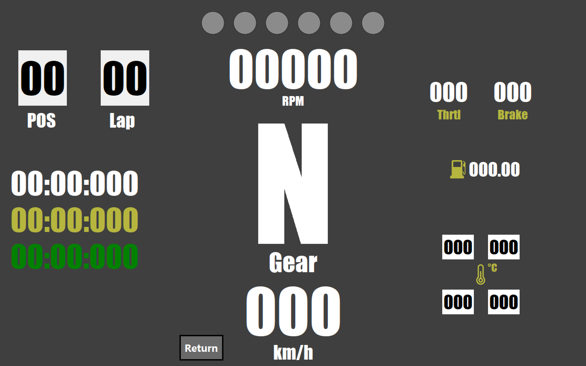

# Forza Digital Dashboard
## Live telemetry display for both forza horizon and motorsport series

## [Demo video](https://www.youtube.com)

## Screenshots 

# Installation
You do not need to download or build the source code to use this app. Simply download "dist.zip" zip file from the Releases section on this GitHub page, extract its content, and run "main.exe" directly.
NOTE: Microsoft Defender may block the app from running, if you recieve a popup, please click on "More Info", then "Run Anyway" 

No additional installation or dependencies are required.
# Attributions
[Fuel icons created by Those Icons - Flaticon](https://www.flaticon.com/free-icons/fuel)

[Tempreture icons created by Grafixpoint - Flaticon](https://www.flaticon.com/free-icons/tempreture)

[Speed icons created by Freepik - Flaticon](https://www.flaticon.com/free-icons/speed)

[Camieis font created by Paulo R - Fontspace](https://www.fontspace.com/camieis-font-f17248)
